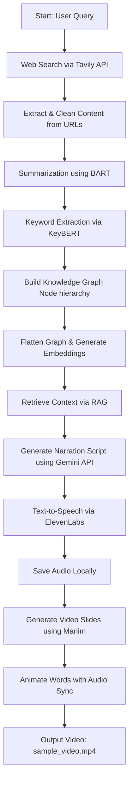

# klaro

# **An E2E pipeline for generating educational videos using AI and automation**

This project generates educational videos from web sources using a **knowledge graph + RAG pipeline** with narration and subtitles. Videos are rendered using **Manim** with word-level animations synced to AI-generated speech.

---

## Project Structure

```
├── main.py                     # Main pipeline
├── knowledge-graph-dump/       # Cached knowledge graphs
├── narration-audio/            # Generated audio files
├── narration-script/           # Structured narration scripts
├── out/                        # Generated video and media
├── requirements.txt            # Python dependencies
├── .env                        # API keys

```

---

## Features

- **Knowledge Graph Construction:** Builds hierarchical nodes from web sources based on a query.
- **RAG Retrieval:** Retrieves relevant content using embeddings from `SentenceTransformer`.
- **Narration Script Generation:** Uses Gemini API to produce structured slide content.
- **Audio Generation:** Converts narration to speech with **ElevenLabs** with word-level timestamps.
- **Video Generation:** Animates slides using **Manim**, displaying text word-by-word in sync with narration.
- **Caching:** Stores knowledge graphs, scripts, and audio locally to reduce redundant API calls.

---

## Workflow



> The diagram above shows the end-to-end pipeline from a query to the final video output.
> 

---

## Installation

1. Clone the repository:

```bash
git clone https://github.com/rachitbhandarii/klaro.git
cd klaro
```

1. Set up a Python virtual environment:

```bash
python -m venv venv
source venv/bin/activate  # Linux/macOS
venv\Scripts\activate     # Windows
```

1. Install dependencies:

```bash
pip install -r requirements.txt
```

1. Add environment variables in `.env`:

```
GEMINI_API_KEY=<your_gemini_api_key>
ELEVENLABS_API_KEY=<your_elevenlabs_api_key>
TAVILY_API_KEY=<your_tavily_api_key>
```

---

## Usage

1. Set your topic in `pipeline.py`:

```python
query = "Russia leaves Nuclear Arms Treaty with US"
```

1. Run the main script:

```bash
python pipeline.py
```

1. Outputs are stored in `out/`:
- Video: `out/videos/pipeline/sample_video.mp4`
- Audio: `out/video/pipeline/sample_video.wav`
- Knowledge Graph JSON: `knowledge-graph-dump/`
- Narration Scripts: `narration-script/`

---
