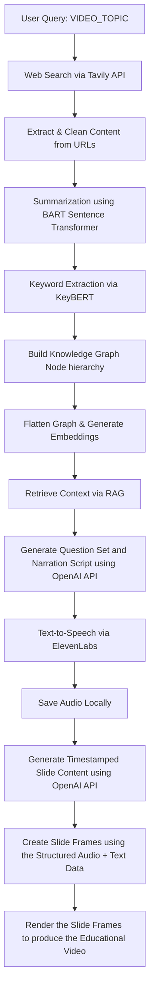

# klaro

## **An E2E pipeline for generating educational videos using AI and automation**

**klaro** is an educational video generator, given a topic, by leveraging **research** and **content automation** through **web scraping**, **NLP**, and **TTS** to generate structured outputs and narration for topics of interest. This project is implemented using **Python** and **React** (**Remotion**) for video rendering.

---

## Here is a sample output generated using klaro

**Input**

```bash
VIDEO_TOPIC="Russia leaves nuclear arms treaty with us"
```

**Output**

[russia-leaves-nuclear-arms-treaty-with-us.mp4](https://drive.google.com/file/d/1jVRPCfgn9QiLhAxuIsptpww-JinVN439/view?usp=sharing)

---

## Project Structure

```
klaro/
├─ node_modules/
├─ out/                                 # contains final output -> {VIDEO_TOPIC}.mp4
├─ public/
│ └─ {VIDEO_TOPIC}/                     # contains all the json and audio dump files
│ ├─ audio/                             # contains audio for each slide in mp3 format
│ ├─ audio-json-dump/                   # contains json of base64 audio with timestamps
│ ├─ final-content/                     # contains all round json file for video generation
│ ├─ knowledge-graph-dump/              # contains structured chunks of data from the web in json
│ ├─ narration-audio/                   # contains json with narration audio in base64
│ ├─ narration-outline/                 # contains json with outline of the video
│ ├─ narration-script/                  # contains json with narration content
│ └─ web-search-results/                # contains json of urls per keyword
├─ src/
│ ├─ index.css
│ ├─ index.tsx
│ ├─ Root.tsx                           # contains components to be rendered
│ ├─ Slide.tsx                          # the gui template of each slide
│ ├─ SlidesRenderer.tsx                 # handles chronology and transitions of slides
│ ├─ BlankComponent.tsx                 # empty scene to be rendered in case no json is present
│ └─ types.ts
├─ .prettierrc
├─ eslint.config.mjs
├─ package.json
├─ package-lock.json
├─ postcss.config.js
├─ remotion.config.ts
├─ tsconfig.json
├─ pipeline.py                          # structured data generation pipeline
├─ requirements.txt                     # dependencies to be installed for pipeline.py
├─ .env                                 # set VIDEO_TOPIC and other API keys
└─ README.md
```

---

## Features

- **Knowledge Graph Construction →** Builds hierarchical nodes from web sources based on a query using **Tavily API** and extracts clean summary and keywords using **BART** and **KeyBERT**.
- **RAG Retrieval →** Retrieves relevant content using embeddings from **Sentence Transformer**.
- **Narration Script Generation →** Uses **OpenAI API** to produce structured slide content.
- **Audio Generation →** Converts narration to human like speech with **ElevenLabs API** with word-level timestamps.
- **Caching →** Stores knowledge graphs, scripts, and audio locally to reduce redundant API calls.
- **Video Generation** → Binds the audio and text data provided as json to create and render a video with **Remotion**.

---

## Workflow



> The diagram above shows the end-to-end pipeline from a query to the final output.
> 

---

## Installation

### Clone the repository

```bash
git clone <https://github.com/rachitbhandarii/klaro.git>
cd klaro
```

### Set up a Python virtual environment

```bash
python -m venv venv
source venv/bin/activate    # Linux/MacOS
venv\\Scripts\\activate     # Windows
```

### Install Python dependencies

```bash
pip install -r requirements.txt
```

### Install Node.js dependencies

```bash
npm install
```

### Add environment variables in `.env`

```bash
OPENAI_API_KEY=<your_openai_api_key>
ELEVENLABS_API_KEY=<your_elevenlabs_api_key>
TAVILY_API_KEY=<your_tavily_api_key>
```

<aside>
💡

ffmpeg should be installed in your system as it is used under the hood for rendering.

</aside>

---

## Usage

### Add this line to your `.env`

```bash
VIDEO_TOPIC="<your_video_topic>"
```

### Run the python script

```bash
python pipeline.py # generates necessary data for your video
```

### Run the python script

```bash
npx remotion render --x264-preset superfast --crf 37
# generates frames for your video and renders it
# you can customise the quality of video and the rendering time with these params
```

---
